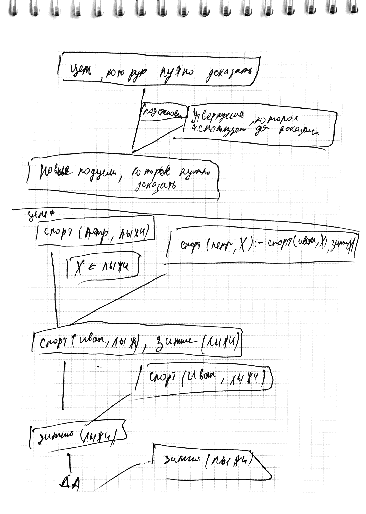

# Назначение переменных в прологе

Переменная Пролога используется для обозначения различных объектов (не является именем конкретнного объекта)

Имя **переменное** должно начинаться с **прописной** буквы

Пример:

`знает (иван, X) :- знает (мария, X)`

`X` - переменная 

# Сопоставление фактов

Если имеет место какое-то отношение между объектами, то такой простейший вид утверждений называется **фактом**

Факт указывает на то, что выполнено некоторое **отношение** между объектами

Имена фактов и объектов должны начинаться **со строчных букв**

Факт: `знает (мария, английский)`

Одноместное отношение определяет **свойство объекта**

`студент(иванов)`

Когда пролог-система отвечает на вопросы, она ищет **факты** и **головы правил**, сопоставимые с целью.

**Два факта сопоставимы** (или соотвутствуют друг другу), если:

1. имена отношений одинаковы (побуквенное совпадение)
2. отношения имеют разное количество аргументов
3. аргументы, расположены в одинаковых позициях, сопоставимы
Сопоставлене аргументов осуществляется по следующим правилам:
    1. имена конкретных объектов сопоставимы, если они совпадают
    2. переменная сопоставима с именем конкретного объекта
    3. переменная сопоставима с другой переменной

1. Сопоставляется
    * цель `знает (иван, английский)` и
    * факт `знает (мария, английский)`
    * Попытка сопоставить цель и факт **неуспешна** (первые аргументы несопоставимы)
2. Пролог продолжает поиск следующего предиката **знает** и находит правило:
    `знает (иван, X) :- знает (мария, X)`
    Цель и голова **сопоставимы** -> переменная X

# Схема логического вывода



# Назначение отсечения, правила отсечения и пример

Отсечение ограничивает поиск решений, запрещая поиск других решений для целей, которые были вычислены к моменту выполнения оператора отсечения. 
Проще говоря, он запрещает переход к другим правилам текущего предиката и откат внутри текущего правила к коду, расположенному до отсечения.

База знаний содержит утверждения:

```
H :- B1, B2, ..., Bm, !, Bm+1,..., Bn (1)
H :- ... (2)
```
и

Цель: G

В процессе доказателства

1. цель G сопоставляется с головой правила
2. доказываются подцели B1, ..., Bm
3. выполняется отсечение !
    1. результат выполнения отсечения:
        1. подцель B1, ..., Bm **не передоказываются** (замораживаются)
        2. цель G связывается только с правилом (1) и другие варианты доказательства G не рассматриваются

Пример. Нахождение наибольшего из двух чисел: 

БЗ:

```
max (X, Y, X) :- X >= Y
max (X, Y, Y)
```

Цель: `max (20, 15, X)`

Ответ: `X = 20, X = 15` **неверно**

Вариант2:

БЗ:

```
max (X, Y, X) :- X >= Y, !
max (X, Y, Y)
```

Цель: `max (20, 15, X)`

Ответ: `X = 20`