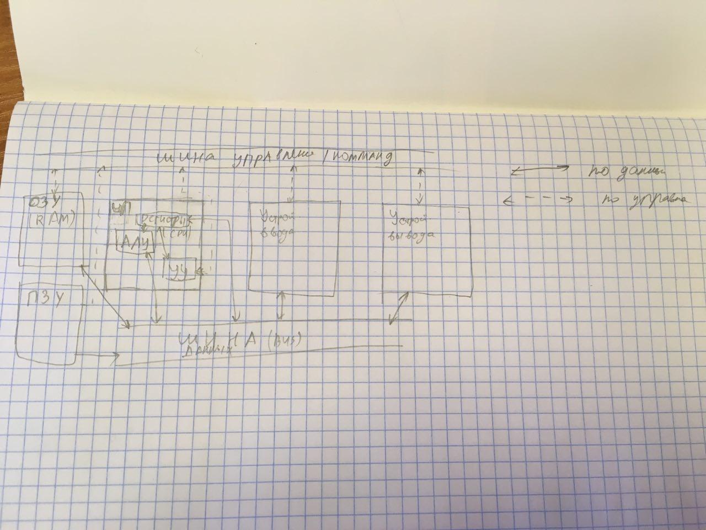
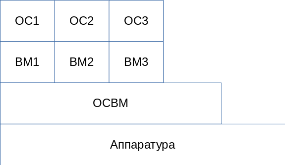

# Операционные системы

Рябинин Константин Валентинович

kostya.ryabinin@gmail.com

## ОС как ядро программного обеспечения

Примеры операционных системы:

* Desktop
  * Solaris
  * Windows
  * GNU/Linux
  * macOS
* Mobile
  * Android
  * iOS

**IoT** (интернет вещей) - это сеть связанных через интернет объектов, способных собирать данные и обмениваться данными, поступающими со встроенных сервисов.

**ENIAC** (14.02.1945) (*Electronic Numerical Integrator and Computer*) - первый электронный цифровой вычислитель общего назначения, который можно было перепрограммировать для решения широкого спектра задач.

**Вычислетельная система** - один или несколько компьютеров, объедененных для решения одной задачи.

**Програмное обеспечение** - весь комплекс программ, установленых в вычислетильное системе + программная документация:

* Прикладное (ППО)
  * MS Paint
  * MS Word
  * Photoshop
* Системное (СПО) - решает задачи без конкретнной предметной области
  * ОС
  * Драйверы оборудования
  * Антивирусы
  * Системы программирования
* Другие (промежуточные между СПО и ППО)
  * СУБД

**ОС** как ядро современного ПО

**ОС** - комплекс программ предназначенных для эффективной организации вычислительного процесса в соответсвии с заданным режимом выполнения программ дерективами программиста и указаниями пользователя.

**Цель ОС** - минимизация вмешательства человека в вычислительный процесс.

**Функции ОС**:

* Управление устройствами
* Управление процессами
* Управление данными
* Взаимодействие с пользователем

**Расширенная машина** (РМ) - компьютер с установленным на нем ПО.
РМ = Железо + ПО

Уровни РМ:

1. ППО
2. Утилиты | Компиляторы | Интерпритатор
3. ОС
4. Микроархитектура
5. Физические устройства

> 4 и 5 - железо (hardware)
> 1, 2, 3 - ПО (software)
> 2 и 3 - СПО
> Разработчик аппаратуры работает с 4 и 5
> Разработчик ОС, программисты, немного пользователи работают с 3
> Драйвер (утилиты) работает с микроархитектурой, но через ОС
> Пользователи и чуть чуть програмисты работают с ППО

**Архитектура** - абстрактное представление системы с точки зрения пользователя или программиста.

ОС состоит из

1. API | UI (PAPI - приватный апи)
2. Модули ОС
3. Ядро (есть свой уровень api)

**API** - application programming interface
**UI** - user interface
**GUI**

Командная строка:

* cmd.exe -> batch `windows`
* bash sh zsh `GNU\Linux`

Используется скриптовый язык прогаммирования

Нативная (native `естественный`) операционная среда

Использование нативых апи - общение с нативной операционной средой

## Загрузка и отладка ОС

**ЦП** - центральный процессор

**АЛУ** - арифметико-логичское устройство

**ОЗУ** - оперативное запоминающее устройсто (энергозависимое)

**ПЗУ** - постоянное запоминающее устройство (энергонезависимое)

ПЗУ с ЦП не связаны напрямую, но шина обеспечивает связь многие-ко-многим

Подходы к архитектуре:

* Архитектура фон Неймана - `x86, x86-64, ARM`

* Принстонская архитектура - `AVM`

При запуске компьютера первым делом запускается `BIOS` (basic input output system)

Принцип `EEPROM`  устройства памяти, по которому работает `bios` 

Первым делам проходит `POST` - проверка целостности ЭВМ

`CMOS` - энергозависимое хранилище для настройки `bios`

Батарейка для `cmos` - `CR-2032 3.3v`

Первый 512 байт хд называются `MBR` (master boot record)

Дальше он передает управление самой ОС или загрузчику `Bootloader`:

* GRUB
* LiLo

**Более современные варианты**

BIOS -> UEFI

MBR -> GPT

Для отладки ОС используются виртуальные машины:

**VM** - Virtual Machine:

* VirtualBox
* VMWare
* DOSBox
* ePSXe

**Дамп (слепок)** - сохранение куска оперативной памяти, как есть, чтобы посмотреть, что произошло

При помощи виртуальных машин можно имитировать ошибку памяти и другие сбои

###  Парадигрмы программирования

* Императивные
  * Процедурные `C`
  * ООП `C Sharp Java`
* Декларативные
  * Функцилнальные `Prolog`
  * Логические `F#`

## Классификация операционных систем

* Количество одновременно работающих программ
  * Однопрограммные `MS DOS, FreeDos`
  * Многопрограммные
* По числу пользователей одновременно работающих в системе
  * Однопользовательские
  * Многопользовательские
*  По режиму исполнения
  * Пакетный `MS DOS`
  * Интерактивный
  * Режим реального времени `FreeDos QNX`
* По структуре
  * Монолитная OS
  * Иерархическая
  * Микроядерная
  * OS виртуальных машин
  * Мультипроцессорная
  * Сетевые

`time` - программа для запуска програм с прослеживанием времени работы программы

Возвращает время:

* real - по часам пользователям
* user - провела время в user режиме
* kernel / system - время ожидание, пока ядро находилось в kernel режиме

Если программа работала на одном процессере и без параллельных вычислений, тогда будет `user + system <= real`

Если процессоров несколько и паралелльные вычисления, то `user + system ? real`

Ядро бывает следующих типов:

* Монолитное
* Модульное
* Микроядро
* Гибридное

`modprobe` - управление модулями ядра в unix

`QNX` - микроядерная ОС реального времени. Микроядерность позволяет разместить ядро полностью в кеше процессора.

Мультиядерные ОС:

* Сильносвязанные - сильно связаны расстоянием (связаны шиной)
* Слабосвязанные - не связаны на прямую, связь только через

В однопроцессорной архитектуре ОС и прикладные программы выполняются в едином модуле, когда в мультпроцессорной архитектуре появляются проблемы организации выполнения ОС и прикладных программ.

Подходы для организации мультпроцессорной архитектуре (сильносвязанные):

* Главный - подчиненный
  Один процессор выбирается главным, на нем выполняется операционная система, а прикладные на остальных, при этом ОС жестко связывает процессор с процессом. ОС выполняется на едином модуле, поэтому она должна быть нереантерабельна.

* Раздельные мониторы
  На каждом из процессоров своя копия операционной системы, из-за чего все они равноправны
* Симмитричная организация (SMP - Symertical Multi Processoring)
  ОС является единой и находится на всех ОС сразу, используется динамическая балансировка нагрузки для распределения программ по процессорам. ОС должна быть реинтерабильна.

Слабосвязанные - на каждой выполняется своя копия ОС, связаны они не напрямую, а через некоторую линию связи

Сетевая модель OSI - стандарт обмена данными (ISO OSI)

1. Прикладной
2. Представительский
3. Сеансовый
4. Транспортный
5. Сетевой
6. Канальный
7. Физичиский

Горизонтальная связь - протокол (Прикладной - Прикладной)

Вертикальная связь - интерфейс (Прикладной - Представитеский)

TCP/IP:

1. Уровень приложений
2. Транспортный уровень
3. Уровеь сети Интернет
4. Уровень доступа к сети

