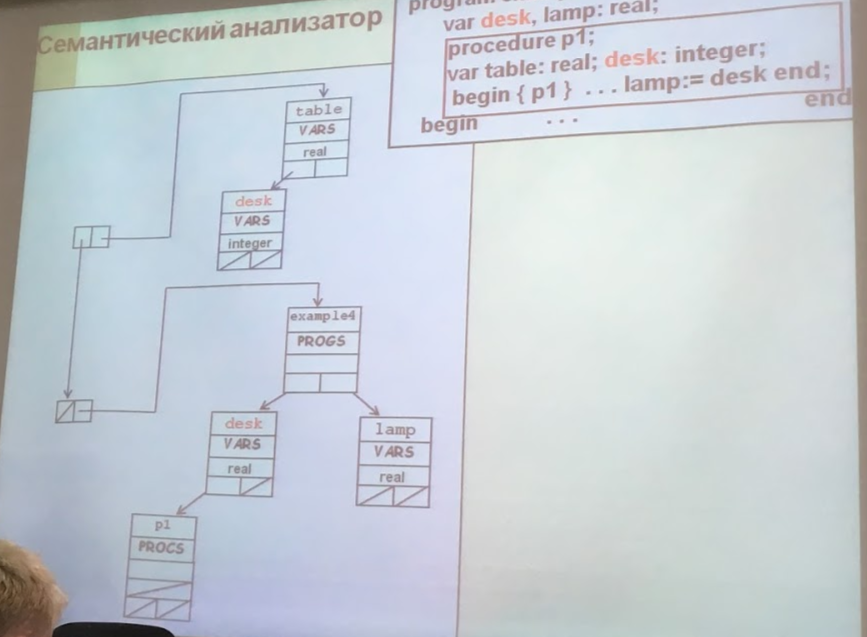

# Как описывается синтаксис языков программирования? Сформулируйте правила описания оператора присваивания.

**Синтаксис ЯП** - набор правил, определяющих множество правильных предложений языка.

Для задания синтаксиса ЯП применяются

1. *формальные правила* - формы Бекуса-Наура и синтаксические диаграмы
2. *неформальные правила*

в любой области действия *без внутренних по отношению к ней областей* никакой идентификатор не может быть описан более одного раза

```
<оператор присваивания> ::=
    <переменная> ::= <выражение> | <имя функции> := <выражение>
```

# Сформулируйте контекстные условия для конструкции:
<условный оператор> ::= if <выражение> then <оператор> | if <выражние> then <оператор> else <оператор>

**Контекстные условия** - синтаксические правила ЯП, которые задаются с помощью естественного языка (неформально)

<выражение> должно иметь тип boolean

# Какой модуль компилятора формирует коды символов? Приведите пример, содержащий исходную программу и результат ее представления в виде набора кодов. Какому модулю передаются эти коды?

Лексический анализатор (Сканер) группирует последовательность литер переменной длинны в символы. Кода символов удобно хранить в виде целых чисел.

```
program example;
    const d = 10;
    var a, s, d: integer;
        m, n: real;
    end
begin...
```
```
Коды символов:
program 1
example 2
; 3
...
```
```
Результат работы лексического анализатора -
1 2 3
...
```

Эти коды передаются на синтаксический анализатор.

# Какой модуль компилятора работает с таблицей идентификаторов (ТИ)? Какая информация хранится в ТИ и как эта информация используется?

Проверка контекстных условий требует знания атрибутов идентификаторов, используемых в программе. Анализатор получает эту информацию из описаний.

Семантический анализатор работает с таблицей идентификаторов.

Для каждой области действия создается ТИ.

ТИ представляет собой дерево поиска с вершинами, связанными указателями.

Дерево хранит в себе hash-сумму для идентификатора, адрес в имени таблице имен, способ использования идентификатора.

Если при обработке прикладного вхождения идентификатора не нашлось его в ТИ, то необходимо сформировать сообщение об ошибке, и занести в ТИ неопределенный идентификатор с атрибутами, полученными из контекста.

