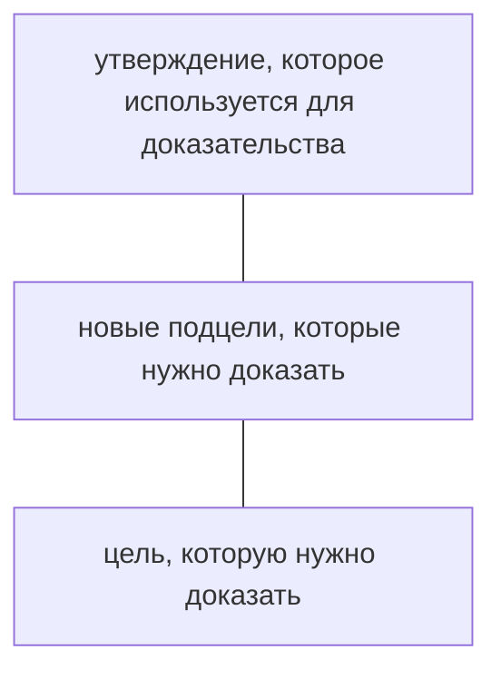

**Парадигма** - определенный способ мышления, служащий основой для создания языков программирования

* Процедурная
* Объектно-ориентированная
* Функциональная
* Логическая


**Осн. понятия** программ, написанных на
- машинных
- машинно-ориентированных,
- процедурных и объектно-ориентированных языках:


**Переменная** _(ячейка памяти)_ - поименованное место памяти, куда можно записать значение
 Переменные обладают значениями, которые могут изменяться инструкцией присваивания или ввода

**Состояние** -  значения некоторого множества (набора) переменных
 Программы написанные на императивных языках основаны на изменении состояний (значений переменных)

* **Первоначальное состояние** - входные данных
* **Заключительное состояние** - сортированный массив
* **Промежуточные состояния** - значения элементов массива на этапе сортировки

**Инструкция** *(команда или оператор)* - определяет некоторое действие, например, присваивание, ввод, вывод, ветвление, цикл и др.


**Императивное программирование** - это парадигма программирования, которая описывает процесс вычислений в виде инструкций, изменяющих состояния.
Императивный стиль основан на особенностях архитектуры Фон Неймана, использующейся в настоящее время.

В результате выполнения процессором последовательности инструкций изменяется состояние памяти


**Функция** - правило, по которому каждому элементу одного множества ставится в соответствие единственный элемент другого множества.

**Функция N переменных** - правило, по которому каждой совокупности независимых друг от друга элементов x, y, z, ..., n некоторого множества ставится  соответствие единственный элемент другого множества

**Функциональное программирование** - это способ составления программ, в котором единственным действием является - вызов функции.

**Функциональная программа** - последовательность определений функций, за которой следует последовательность вызовов этих функций.

Взаимодействие между разными функциями возможно только через вызовы во время выполнения программы.

Функциональная парадигма не должна рассматриваться как замена императивному программированию, она лишь представляет другой подход к разработке программ.

Функциональная парадигма применяется для -
* Создания систем ИИ
* Разработки граф интерфейсов
* Создания граф приложений реального времени
* Разработки систем параллельных вычислений
* Построения компиляторов
* Техрасчетов
* В финансовой и научной областях

**Композиция функций** - построение новых функций из ранее определенных функций.

## Пример:
```fsharp
макс (х, у)
наиб (х, у, т) = макс(макс(х,у),т)
```

**Имена**, которые объявляются в функциональной программе, являются **неизменяемыми**

Переменные используются только для того, чтобы дать имена значениям аргументов функции и связаны с этими постоянными значениями на протяжении всего вычисления выражения, определяющего результат функции

> ФУНКЦИОНАЛЬНАЯ ПРОГРАММА НЕ ИМЕЕТ СОСТОЯНИЯ, В ФП ОТСУТСТВУЕТ ПРИСВАИВАНИЕ.

> В ФП НЕТ ЦИКЛОВ

**Повторяющиеся** вычисления реализуются через **рекурсию**

В ФП проблема изменений значений переменных решается путем создания новых переменных.

## ПРИМЕР

В результате рекурсивного вызова создается секция стека, в которую записывается копия переменной и её новое значение.

**КОМПОЗИЦИЯ И РЕКУРСИЯ** - основные средства ФП

**Детерминированная функция** - функция, которая всегада возвращает один и тот же результат для одинаковых аргументов.

**Побочный эффект** - то что делает функция, кроме вычисления возвращаемого значения
* Запись данных в файл
* Вывод на экран
* Изменение баз данных
* ...

В императивных языках используются глобальные переменные. Изменение их значений в теле функции - побочный эффект.


**Чистая функция** - детерминированная функция без побочных эффектов

Преимущества чистых функций
* Проще тестировать
* Проще повторно использовать
* Из них легче составлять сложные программы
* Могут вычисляться одновременно

В функциональных языках функции рассматриваются как данные
Функции могут быть аргументами других функций
Функции могут создавать и возвращать новые функции

**Функция высшего порядка** - функция, которая
Принимает в качестве аргументов некоторые функции
ИЛИ
Возвращает в качестве результата функцию

В императивных языках программирования вызов функции приводит к вычислению всех её аргументов
Альтернатива такого подхода - **ленивая стратегия**, согласно которой вычисления следует откладывать до тех пор, пока не понадобится их результат.

В этом случае значения аргументов не вычисляются, если они не используются в теле функции.

-----------------------

Идентификаторы используются для именования значения
**Оператор let** связывает значение с идентификатором

```fsharp
>let x = 1;
val x: 1

>let myfunc = x+1;
val myfunc : int -> int

> myfunc 10;
val it: 21

> let add x y = x+y
val add : int -> int -> int
```

F# язык программирования со статической типизацией

**Статическая тиизация означает, что**
каждое значение и выражение имеет определенный тип во время компиляции
все проверки соответствия типов выполняются на этапе компиляции

В случае динамической типизации проверки соответствия типов выполняются при каждом запуске программы

**F#** - язык программирования со строгой типизацией, статической типизацией, поддерживающий концепцию вывода типов

**Кортеж** - совокупность данных, которая может содержать любое количество элементов разных типов
```fsharp
let divRem a b =
    (a,b)
```

#   Область действия имен

**Тело функции может содержать определения индефикаторов** - локальных имен значений и функций.

1.  В  F# можно объъявить новую функцию в теле другой функции, т.е. функции могут быть вложенными
2. Область действия идентификатора - тело функции, в которой он объявлен
3. Вложенные функции имеет доступ к любым значениям, объявленным в объемлещюей функции.

*Именно отступ указывает на то, что определение идентификатора находится внутри тела функции*


## Пример

```fsharp
let defineMessage1 () =
    let message = "Visual Studio C#"
    printfn "%s" message
    let defineMessage2() =
        let defineMessage3() =
            let message3 = "Visual Studio F#"
            printfn "%s" message3
        let message2 = "Visual Studio J#"
        printfn "%s" message2
        defineMessage3()
    defineMessage2();;
```

```
> defineMessage1();;
Visual Studio C#
Visual Studio J#
Visual Studio F#
```

## Пример
```fsharp
let f() =
    let g () =
        let x = 10
        printfn " g_result = %i" (20 + x)
    g()
    printfn "f_result = %i" (20 + x)
```

`> f();;`<br>
`printfn "f_result = %i" (20 + x) error`

```fsharp
let f() =
    let x = 5
    let g() =
        let x = 10
        printfn "g_result = %i" (20 + x)
    g()
    printfn "f_result = %i" (20 + x)
```
```
f();;
g_result = 30
f_result = 25z
```

# Условные выражения

__Синтаксис условного выражения__

`if <логическое выражение> then <выражение_1> [else <выражение_2>]`

> Условное выражение возвращает значение

> Типы значений **выражения_1** и **выражения_2** должны совпадаеть

> Если ветвь `else` отсутствует, то **выражение_2** имеет тип `union`

## Пример

```fsharp
let isEven x =
    let result =
        if x % 2 = 0 then "число четное"
            else "число нечетное"
```


## Пример

```fsharp
let myday day =
    if day = "понедельник" then printfn "понедельник"
        elif day = "вторник" then printfn "вторник"
            elif day = "среда" then prinfn "среда"
                else prinfn "четверг"
```

# Рекурсивыне функици

> В ИП циклы основны на *изменении некоторого значения* (в параметре цикла или условия окончания)

В ФП значения являются **неизменяемыми**

> *При реализации рекурсии*: **вызываемая** функция должна решать более **простую** задачу, чем **вызывающая**, иначе рекурсия никогда не закончиться

* Функция должна **вызывать сама себя** для решения более **простых** задач

## Пример

```fsharp
let rec sum n =
    if n = 1 then 1
        else n + sum (n - 1)
```

|аргумент n|значение функции sum n|
|-|-|
|5|
|4|
|3|
|2|
|1|

## Пример. Факториал

```fsharp
let rec fact n =
    if n = 0 then 1
        else n * fact(n - 1)
```

## Пример. Все числа между двумя заданными

```fsharp
let rec printx_y x y =
    if x >= y then printfn "%d" x
        else prinftn "%d" x
        printx_y (x + 1) y
```

# Каррирование

> **Каррирование** - это возможность функции принимать аргументы по одном, каждый раз возвращая новую функцию от меньшего числа аргументов

## Пример. Сложение двух чисел

`> let add x y = x + y;;`
`val add : int -> int -> int`

Каррируем (фиксируем) первый параметр функции и, таким образом создаем функцию, принимающую второй параметр:

`> let addFive = add 5;;`
`val addFive : (int -> int)`

> `addFive` - каррированная функциия

`> let result - addFive 10;;` вызов каррированной функции<br>
`val result : int = 15`

> Карринг объясняет наличие стрелки в типе функции между ее аргументрами:

`> let add1 (x:float) (y:float) = x + y` <br>

## Прмиер. Вывод целых чисел

```fsharp
> let x = 3;;
val x : int = 3
> let y = 10;;
val y : int = 10
> let print_int = printfn "%d";;
val print_int : (int -> unit)
> print_int x;;
3
val it : unit = ()
> print_int y;;
10
val it : unit = ()
```

## Пример. Вывод вещественных чисел

```fsharp
> let sq x = x*x;;
val sq : int -> int
> printfloat = printfn "\n %5.2f";;
val printfloat : (float -> unit)
> printfloat (float 5);;
5.00
val it : unit = ()
```

# Частично применимые функции

Частичное примененеи дает возможность
* **зафиксировать** значение **нескольких** аргументов функции
* **создать** новую функцию **с меньшим** числом аргументов

## Пример. Частичное примене

```fsharp
> let add x y z = x + y + z;;
val add : int -> int -> int -> int
> let addf = add 4 5;;;
val addf: (int -> int)
> addf 2;;
val it : int = 11
```

# Рекурсия и каррирование

## Пример.

```fsharp
> let rec mypow n x =
    if n = 0 then 1.0
        else x * mypow (n - 1) x;;
val mypow : int -> float -> float
> let square = mypow 2;;
val square : (float -> float)
> square 5.0;;
val it : float = 25.0
> let five = mypow 5;;
val five : (float -> float)
> five 3.0;;
val it : float = 243.0
```

# Кортежи

> **Кортежи** - совокупность данных, которая может содержать **любое** количество элементов **любых** типов.

> При записи типа кортежа используется символ `*`

## Пример

```fsharp
> let x = (1,2,"aaa","fff",1.2);;
```

```fsharp
> let d (x1,y1) (x2,y2) = sqrt ((x2 - x1))**2.0 + (y2 - y1)**2.0
> d (1.0, 1.0) (2.0, 2.0);;
```

# Операции над кортежами

1. Извлечение элементов их двухэлементного кортежа:<br>
Функция `fst` - извелечение первого элемента
`snd` - извлечение второго элемента

2. Извлечение элементов из кортежа произвольной длины
Если за ключевым словом `let` указать несколько имен, разделенных запятыми, то с этими именами будут связаны значения элементов кортежа.
```fsharp
> let y = (1, 'd', 3.4);;
> let y1, y2, y3 = y;;
```

# Сопоставление с образцом

Конструкция **Сопоставления с образцом**: <br>
```fsharp
match выражение with
| образец_1 -> выражение_1
| образец_2 -> выражение_2
...
| образец_n -> выражение_n
```

> Все варианты должны возвращать значение одного типа

1. Образец - константа
```fsharp
let f i =
    match i with
    |0 -> "Zero"
    |1 -> "One"
    |2 -> "Two"
    |_ -> "None"
```

2. Образец - переменная
```fsharp
let f i =
    match i with
    |0 -> "Zero"
    |x -> x
```

3. Образец - кортеж
```fsharp
let f z =
    match z with
    | (1.0, 2) -> "First"
    | (_, _) -> "Other"
```

4. Дополнительная проверка при сопоставлении с образцом
```fsharp
let rec luc x =
    match x with
    | x when x <= -> -100
    | 1 -> 1
    | _ -> luc (x - 1) + luc (x - 2)
```

5. Объедение нескольких образцов
```fsharp
let test c =
    match c with
    | 'a' | 'b' | 'c' -> true
    | _ -> false
```

6. Образец может содержать
```fsharp
let testand x y =
    match x, y with
    |1, _
    |_, 1 -> "одно из них равно 1"
    |x,y -> "другие"
```

7. Если набор вариантов не учитывает все возможные значения выражения, то компилятор выводит предупреждение
```fsharp
let f i =
    match i with
    | 1 -> "One"
```
`error`


## Пример. Рекурсия и сопоставление с образцом. Игра "Угадай число"

```fsharp
open System;
> let play_game () =
    let rng = new Random()
    let Number = rbg.Next() % 100
    let rec play_step () =
        printfn "введи число"
        let Str = Console.ReadLine()
        let N = Convert.ToInt32(Str)
        match N with
            | _ when N > Number -> printfn "Загаданное число меньше"
                                   play_step()
            | _ when N = Number -> printft "Вы угадали!"
            | _ -> prinftn "Загаданное число больше"
                                   play_step()
    play_step()
printfn "Компьютер загадал число. Угадайте его"
play_game();;
```
# Анонимные функции

**Анонимная функция** - функция без имени

Особенности описания анонимной функции:
* описание наичнается с ключевого слова `fun`
* после списка аргументов записывается знак `->`

## Пример

```fsharp
fun a b c -> printfn "%i %i %i" a b c
fun a b -c -> a + b *c
```

## Пример

```fsharp
> let x = (fun x y 0> x + y )
```

### Использование

1. Описание и немедленный вызов функции

2. Передача функции в качестве аргумента другой функции

# Списки

**Список** - упоядоченый набор элементов одного типа

Объявление списка перечислением всех значений:
```
> let x = [1;2;3;4;5]
let y = [];;
```

> Пустой список имеет тип `a list`, так как может содержать элемент любого типа

## Пример

1. Информация об игроках теннисного клуба

```fsharp
> let club =
[("Mary", 20, 10);();()]
```

2. Представление данных в программе игры в шахматы

```fsharp
let cdesk = [(["белый"; "король"], [4;7]);(["черная", "пешка"], [7;8])]
```

## Внутренние представление списоков

Каждый элемент списка содержит:

* значение и
* ссылку на следующий элемент *за исключеием последнего элемента*

## Операции над списками (всего две):

1. Добавление элемента в начало списка

```fsharp
> let x  = [1;2;3;4;5]
let z = 0 :: x;;
var z : int list = [0;1;2;3;4;5]
```

## Внутреннее представление

Новый список получается так:
* создается новый элемент и
* его ссылке присваивается адрес *исходного* списка

> Теперь можно работать как с исходным списком `x`, так и с новым списком `z`

2. `@` - Объеденение двух списком

```fsharp
> let y = [7;8;9];;
> let v = x@y
var it: int list = [1;2;3;4;5;6;7;8;9]
```

## Внутреннее представление
(картинка с внутренним )

**В ФП данные неизменяемы!**<br>
Из-за необходимости модифицировать последний элемент первого списка
* создается полная копия первого списка
* второй список остается неизменяемым

### Объявление списка с помощью диапазона

```fsharp
> let x = [1..10];;
> let y = [1..2..10]
```

### Объявление списка с помощью циклической инструкции

```fsharp
> let z = [for i in 1..5 -> i*i];;
```

## Функции модуля `List`

* `List.lenght` - возвраещаяет длинну списка
* `List.head` - возвращает голову списка
* `List.tail` - возвращает хвост списка
* `List.rev` - изменяет порядок элементов списка на противоположенный
* `List.map` - создается новый список на основе заданной функции
* `List.sort` - сортирует список
* `List.find` - поиск первого элемента, удволетворяещму условию
* `List.findIndex` - поиск индекса элемента первого элемент, удволетворяющему условию
* и др.

## Пример использования функции модуля `List`

Выделение из списка **первого** элемента
```fsharp
> let x = [1;2;3;4;5];;
> let first = List.head x;;
```
Выделение из списка **второго** элемента
```fsharp
> let second = List.head ( List.tail x );;
```
Выделение из списка **третьего** элемента
```fsharp
> let third = List.head ( List.tail ( List.tail x ));;
```

```fsharp
> let sq x = x*x;;
> List.map sq [1..10];;
val it : int list = [1;4;9;16...]
> let z1 = List.map sq x;; // x = [1;2;3;4;5]
val z1 : int list = [1;4;9;16..]
```
или
```fsharp
> let z1 = List.map (fun x -> x*x) x;; // x = [1;2;3;4;5]
```
```fsharp
//x = [1;2;3;4;5;6;7;8]
> List.find ( fun elem -> elem % 2 = 1) x;;
val it : int = 1
```

```fsharp
> let x1 = [4;2;7];;
> List.findIndex (fun elem -> elem %2 = 1) x1;;
val it : int = 2
```

# Рекурсионная обработка списка

## Сумма элементов списка

### Вариант 1. Испльзование модуля `List`

```fsharp
> let rec summa x =
    if x = [] then 0
        else List.head x + summa (List.tail x);;
```

### Вариант 2. Деление списка на голову и хвост

```fsharp
> let rec sum list =
    match list with
        | [] -> 0
        | head :: tail -> head + sum tail;;
```

## Формирование нового списка удалением отрицательных элементов

```fsharp
> let rec positive l =
    match l with
    | [] -> []
    | h::t when h < 0 -> positive t //1
    | h::t -> h::positive t //2
```

|down|cond|up|
|-|-|-|
|`[1;-2;3;-4;5;-6;7]`|2| `[1;3;5;7]`|
|`[-2;3;-4;5;-7;7]`|1|`[3;5;7]`|
|`[3;-4;5;-6;7]`|2|`[3;5;7]`|
|`[-4;5;-6;7]`|1|`[5;7]`|
|`[5;-6;7]`|2|`[5;7]`|
|`[-6;7]`|1|`[7]`|
|`[7]`|2|`[7]`|
|`[]`| |`[]`|

## Преобразование списка в одноуровневый список

```fsharp
> let listOfList = [[1;2;3];[4;5;6];[7;8;9]]
let rec concatList l =
    match l with
    | [] -> []
    | head :: tail -> head @ concatList tail;;
```

# Прямой конвейерный оператор

Выделение из списка третьего элемента

```fsharp
> let z = [1;2;3;3;5;6]
> let cl = List.head ( List.tail ( List.tail x));;
val cl : int = 3
```

> Особенность прямого  конвейерного оператора: **порядок записи функции совпадает с порядком их завершения**

```fsharp
let z4 =
z
|> List.tail
|> List.tail
|> List.head;;
```

> Особенность прямого оператора композиции: **объеденяет последовательные вызовы функции в новую функцию**

```fsharp
> let compos = List.tail >> List.tail >> List.head
let v = compose z;;
```

# Размеченные объеденения

Размеченное объеденение определяет множество **именнованных вариантов**, которые могут иметь разные типы

```fsharp
    type имя_типа =
        |идент1 [of тип1]
        |идент2 [of тип2]
```

# Деревья

**Дерево** - конечное множество `T`, состоящее из одного или более узлов таких, что,

1. имеется один специально выделнный узел, называемый **корнем** дерева
2. остальные узыл (исключая корень) содержатся в m >= 0 попарно неперсекающихся **множиествах t1, t2,...,tm** каждое из котороых является деревом.

# Деревья выражений

Узел дерева выражений:

* элемент, содержащий *операцию* и поддеревья (два поддерева), либо
* элемент, содержащий *значение* без поддеревьем  (лист)

## Описание дерева выражений

```fsharp
type ExprTree =
    | Op of char*ExprTree*ExprTree
    | Value of int
```

## Создание дерева выражений

```fsharp
let x = 3
let sample = Op('+', Op('*',
                        Value(2),
                        Value(x)
                    ),
                    Value(1)
                )
```

## Вычислить значение выражения, представленного корня

```fsharp
let rec compute tree =
    match tree with
        | Value (x) -> x
        | Op ( op, L, R) ->
            match op with
                | '+' -> compute L + compute R
                | '-' -> compute L - compute R
                | '*' -> compute L * compute R
                | '/' -> compute L / compute R
printfn "compute = %A" (compute sample)
```

# Деревья поиска

**Узел дерева поиска**:

* элемент, содержащий значение или два (возможно пустых) поддерева - левое и правое

Описание вершины дерева

```fsharp
type BinTree =
    | Node of int*BinTree*BinTree
    | Empty
```

Определение конкретного дерева

```fsharp
let myTree =
    Node (1,
        Node (0, Empty, Empty),
        Node (3,
            Node (2, Empty, Empty),
            Node (5, Empty, Empty)
        )
    )
```

## Вычисление количества вершин в дерева поиска

```fsharp
let rec count1 (tree1:BinTree) =
    match tree1 with
        | Node (data, left, right) ->
            1 + count1 left + count1 right
        | Empty -> 0
let vertex = count1 myTree;;
```

# Хвостовая рекурсия

### Пример. Суммирование элементов списка

```fsharp
let rec summa l=
    match l with
    | [ ] -> 0L
    | h :: t -> h + summa t
let z = summa [1L..100000L]
```

|Уровень вложенности рекурсии|агумент|значение|
|-|-|-|
|1|[1,2,3,4]|`1 + sum[2,3,4]` 13|
|2|[2,3,4]|`2 + sum[3,4]` 9|
|3|[3,4]|`3 + sum[4]` 7|
|4|[4]|`4 + sum[]` 4|
|5|[ ]|`0` 0|

> После выхода из текущего рекурсивного выхова в предыдущий вызов нужно выполнить операцию сложения (точка возврата)

> Необхиоидмо предварительно сохранять **точку возврата** и **первый операнд** операции сложения

> Используется стек областей данных (содержит точку возвата, параметр, локальные переменные)

> Стек имеет ограниченный размер -> возможно его переполнение

## Хвостовая рекусия

Особенности хвостовой рекурсии:

1. Рекурсивный вызо **единственный** и является **последним действием**  функции
2. Результат функции формируется **на сумматоре(аккумаляторе)**

### Суммирование элементов списка

```fsharp
let rec h_summa x acc =
    match x with
    | [] -> acc
    | h::t -> h_summa t (acc + h)
let z = h_summa x 0
```

### Суммирование элементов списка

```fsharp
let summa x =
    let rec h_summa x acc =
        match x with
        | [] -> acc
        | h::t -> h_summa t (acc + h)
    h_summa x 0L
let z = summa [1L..150000L]
```

|Уровень вложенности рекурсии|Аргументы|
|-|-|
|1|[1,2,3,4] 0|
|2|[2,3,4] 1|
|3|[3,4] 3|
|4|[4] 6|
|5|[] 10|

> при увеличении уровня вложенности рекурсии значение функции постепенно накапливается на аккумуляторе

> после получения окончательного значения происходит последовательный выход из всех рекурсивных вызовов без выполения каких-либо допольнительных действий

> стек не нужен

## Задача  `Анализ размерности`

> Размерности физических величин выражаются в терминах фундаментальынх единиц: **массы(M)**, **длины(L)** и **времени(T)**

### Пример. Размероности величин:

площать - `L^2`, скорость - `LT^-1`, ускорение - `LT^-2`

### Пример. Правильная запись уравенения

Дано уравнение: `v = u +`

Представление формлы:

`v = u + f * t` -> `0 = u + f * t - v`

#### Подзадачи:

* выбрать представление размерностей
* выбрать представление анализируемых выражений
* написать функцию, которая
  * воспринимает аримфметическое выражение
  * выдает как результат его размерности

## 1. Выбор представления размерностей

Общий вид размерностей: `M^(n1) L^(n2) T^(n3)`
Представление размерностей величины: список `[n1, n1, n3]`

`0 = u + f * t -v`

Представление размерности величины:

* `v,u` - `LT^-1` -> размерность `[0;1;-1]`
* `f` - `LT^-2` -> размерность `[0;1;-2]`
* `t` - `T` -> размерность `[0;0;1]`


Размерности выличин, используемых в формуле:
список `[(v1, d1); (v2, d2); ... (vn, dn)]`

`vi` - величина

`di` - ее размерность

### Пример. Список размерностей для формулы 0 = u + f * t - v

```fsharp
[('u',[0;1;-1]); (`v`,[0;1;-1]);('f',[0;1;-2]);('t', [0;0;1])]
```

## 2. Представление выражений - дерево выражений

Формула: `0 = u + f * t -v`

описание дерева выржаний:

```fsharp
type ExprTree =
    | Op of char * ExprTree * ExprTree
    | Value of char
```

## 3. Описать функцию `dim`, которая для заданной величины выдает ее размерность

**аргументы функции** - величин и список ее размернсотей
**результат функции** - размерностей величины

```fsharp
let rec dim x a =
    match a with
    | [] -> [] //нет величины
    | (y1, y2)::tail ->
        if x = y1 then y2
            else dim x tail
```

### Проверка 1:

```fsharp
let c = dim 't' alist
Ответ [0;0;1]
let c1 = dim 'g' alist
Ответ []
```

## 4. Описать функцию test, которая вычисляет размерность выражения

**аргумент функции `e`**: дерево выражения
**аргумент функции `a`**: список размерностей

```fsharp
let rec test e a =
    match e with
    | Value (x) -> dim x a
    | Op (op, L, R) ->
        match op with
        | 'x' | '-' -> eqdim (test L a) (test R a) //сравнивам размерност
        | '*' -> adddim (test L a) (test R a) //складываем размерности
        | '/' -> subdim (tset L a) (test R a) //вычитаем размерности
        | _ -> []
```

## 5. Описать функцию `eqdim` сравнения размерности

```

```

## Задача "Анализ размерностей" (итог)

```fsharp
open System

type ExprTree =
    | Op of char * ExprTree * EpxrTree
    | Value of char

let rec test e a =
    match e with
    |Value(x) ->
        let rec dim x a =
            match a with
            |[] -> []
            |h::t -> if x = fst h then snd h
                                  else dim x t
        dim x a
    |Op(OP,L,R) ->
            match OP with
            |'+'|'-' ->
                let eqdim l1 l2 =
                     if l1 = l2 then l1
                     else []
                eqdim (test L a) (test R a)
            |'*' ->
                let rec adddim l1 l2 =
                    match l1, l2 with
                    |[],_ -> []
                    |_, [] -> []
                    |h1::t1, h2::t2 -> (h1+h2)::adddim t1 t2
                adddim (test L a) (test R a)
            |'/' ->
                let rec subdim l1 l2 =
                    match l1, l2 with
                    |[],_ -> []
                    |_, [] -> []
                    |h1::t1, h2::t2 -> (h1-h2)::subdim t1 t2
                subdim (test L a) (test R a)
            | _  ->
                [0;0;0]

let TestTree =
    Op ('-',
        Op ('+', Value('u'),
            Op ('*', Value('f'), Value('t'))
        )
    ,Value('v'))
let TestList = [('u',[1;1;-1]);('f',[0;1;-2]);('t',[0;0;1]);('v',[0;1;-1])]


test TestTree TestList |> printfn "Result = %A"
```

# Язык программирования ПРОЛОГ

На языке Пролог, доступно

* описать предметную область (объекты и связи между ними)
* поставить цель (задать вопрос)

Пролог-система автоматически найдет решение (если оно существует)

Другими словами:

Программист сообщает системе, *что известно и задает вопросы*

## Области применения языка Пролог

**Пролог** - язык для решения задач искусственого интелекта

**Искусственный интелект** - область информатики, предметом которой является разработка **программ**, обладающих **возможностями ествественного интеллекта**

Это -

* способность распознвать сложные зрительные и слуховые образы
* понимать естественный язык
* умение обучаться, рассуждать и делать логические выводы

**Экспертные системы** - программы, которые проявляют степень позанания, сравнимую со знаниями **человека - эксперта** в некоторой предметной области

Области прменение таких систем:

* прогноз погоды
* оценка будущего урожая
* медецинская диагностика
* финансирование, управление воздушным транспортом
* управление военными сражениями и многое другое

### Игры

**Правила** любой игры хорошо **формализованы**

Антагонистическая игра двух лиц: играют два игрока, сотрудничество между котороыми невозможно. Если один игрок выиграл, то другой игрок считается проигравшим. В таких играх, компьютер играет против человека.

### Общение с компьютером на естетвенном языке

Здесь имеется ввиду не только способность принимать команды, но и умение самостоятельно составлять предложения.

## Основы языка пролог

Пусть заданы приложения:

* Мария знает английский `(1)`
* Иван знает то же самое, что знает Мария `(2)`

> Иван знает английский

Рассмотрим **формальные методы** представления знаний и вывода заключений

> Базовые понятия Пролога: **факт, правило и цель**

## Факт

В утверждениях `(1)` и `(2)` имеет местно **отношение** между объектами

|Объект|Отношение|Объект|
|-|-|-|
|Мария|знает|английский|

|Отношение (предикат)|Объект (агумент)|Объект (аргумент)|
|-|-|-|
|знает|Мария|английский|

Такой простейший вид утверждений называется **фактом**

> Факт указывает на то, что выполнено некоторое **отношение** между объектами

## Факты (особенности)

Имеет **отношения и объектов** должны начинаться **со строчных букв**

Факт: `Мария знает английский`

на Прологе запишится как: `знает(мария, английский)`

В отношениии нужно учитывать **последовательность перечисления аргументов**:
* отноешния "Иван явлется отцом Федра": `отец(иван, федор)`
* не совпадает с отношением `отец(федор, иван)`

Одноместное отношение определеяет **свойство объекта**

`студент(иванов)`

## Правила

**Правило** используется в том случаи, если необходимо показать, что **некоторый факт зависит от других фактов**(условий)

> Иван знает, то же самое, что знает Мария

> Иван знает X, если Мария знает X

Переменная Пролога используется для обозначения различных объектов (не является именем конкретнного объекта)

Имя **переменное** должно начинаться с **прописной** буквы

Имена **отношений и объектов** должны начинаться со **строчных** букв

Предложение на Прологе запишеться как

`знает (иван, X) :- знает (мария, X)`

Правила содержит:

* условную часть (справа от знака :-) - `голова правила`
* часть вывода (слева от знака :-) - `тело правила`

**Если** тело правила - истинно,
    **то** следствие из него является голова

Перменная X используется вместо любого объекта

невозможно вывести никаких новх

**Факт и правила** - утверждения, из которых строиться **база знаний**(модель знаний человека в определенной предметной области)

## Цель

**Цель** - формулировка вопроса, на который нужно найти ответ.

#### Пример1. Цель: действительно ли Иван знает английский

Потдвердить или опровергнуть справдливоть факта: `знает (иван, английский)`

#### Пример2. Цель: что знает Иван?

Перечислить значения переменных, удовлетворяещих утверждениям базы знаний: `знает (иван, X)`

## Как Пролог-система отвечает на вопросы

> Пролог ищвет **факты** и **головы правил**, сопоставимые с целью

**Два факта сопоставимы** (или соотсветствуют друг другу), если:

1. имена отношений одинаковы (побуквенное совпадение)
2. отношения имеют разное количество аргументов
3. аргумент, расположены в одинаковых позициях, сопоставимы
Сопоставление  аргументов осуществляется по следующим правилам
    1. имена конкретных объектов сопоставимы, если они совпадают
    2. переменная сопоставима с именем конкретного объекта
    3. переменная сопоставима с другой переменной

1. Сопоставляется
    * цель `знает (иван, английский)` и
    * факт `знает (мария, англйиский)`
    * Поптык сопоставить цель и факт **неуспешна** (первые аргументы несопоставимы)
2. Пролог продолжает поиск следующего предиката **знает** и находит правило:
  `знает (иван, X) :- знает (мария, X)`
  Цель и голова **сопоставимы** ->
    переменная X


## Особенности переменых

**База знаний**
`знает (иван, английский)` (7)
`знает (мария, информатика)` (8)
`знает (мария, английский)` (9)
`знает (мария, история)` (10)

**Цель**
`знает (мария, X)`

Переменная цели X не имеет значения (неозначена или свободна)

### Поиск решения

1. Цель сопоставляется с фактом (7). Попытка сопоставить цель и факт *неуспешна*
2. Цель сопоставлется с фактом (8). Переменная X означивается объектом *информатика* -> X больше **несвободна(связана)** Ответ1: *информатика*
> **если** цель успешно доказана, то **переменная** внось становися **свободной**
1. Сопоставлется цель с фактом (9). Переменная X означивается объектом *английский* -> X большй **несвободна(связана)** Ответ2: английский и т.д Ответ3: история

## Конъюнкиця в праиле

**База знаний "Спортивные увлечения"**

знает (иван, английский) (7)
* Зимой **Иван** увлекается **лыжами и коньками**, а летом - **бегом и плаванием**
* **Семен** занимается **лыжами и плаванием**
* **Петр** увлекается **теми же зимними** видами спорта, что и **Иван**

### БЗ:

```
летний (бег)            (1)
летний (плавание)       (2)

зимний (лыжи)           (3)
зимний (коньки)         (4)

спорт (иван, бег)          (5)
спорт (иван, плавание)     (6)
спорт (иван, лыжи)         (7)
спорт (иван, коньки)           (8)
спорт (семен, палавание)        (9)
спорт (семен, лыжи)         (10)

спорт (петр, X) :- спорт (иван, X), зимний (X)
```

**Цель:** `спорт (петр, лыжи)`

## Формальнное описание логического вывода

Процесс доказательства цели удобно представить в виде схемы

Элемент этой схемы изображается так:



//TODO нарисовать схему

## Поиск с возвратом

**Поиск с возвратом** - процесс доказательства цели методом проб и ошибок

//TODO нарисовать схему 2

Цель успешно доказана -> переменная Z становится **свободной** и может быть вновь означена при поиске **других решений**.

## Коньюнкция в цели

**Цель 1:**`спорт (иван, X), спорт (федор, X)`

Вопрос содержит **две цели:**

1. сущесвутет ли какой-нибудь вид спорта X, которым занимается Иван?
2. занимается ли Петр найденным видом спорта X?

**Проблема:** если пролог ищет *все возможные решения* то поиск с возвратом может вызывать вывод *избыточных решений.*

**Цель 3:** команда из двух пловоцов должна принять **участие в эстафете**; перечислить пары ребят, которые могли бы исоставить команду

`спорт (X, плавание), спорт(Y, плавание)`

```
Ответ:
X = иван, Y = иван
X = иван, Y = семен
X = семен, Y = иван
X = семен, Y = семен
```

`спорт (X, плавание), спорт (Y, плавание), X <> Y`

```
Ответ:
X = иван, Y = семен
X = семен, Y = иван
```

`спорт (X, плавание), спорт (Y, плавание), X < Y`

```
Ответ:
X = иван, Y = семен
```

## Дизьюнкция в правиле и цели

Схема движения траспорта между городами A, B, C, D, E и F
//TODO нарисовать схему

**База знаний "Транспорт"**

**Факт БЗ:** существует сообщение между двумя смежными городами:

```
транспорт (a, b)
транспорт (a, c)
транспорт (a, e)
транспорт (a, d)
транспорт (b, a)
транспорт (c, a)
транспорт (e, a)
транспорт (d, a)
```

*Правила БЗ:* можно доехать из одного города в другой:

```
путь (X, Y) :- транспорт (X)
//TODO
```

**Цели:**
```
путь (a, d); путь (a, f)
путь (f, d); путь (f, e); путь (f, b)
```

Цель считается доказанной, если доказана **хотя бы одна подцель**

## Отриацие в правиле и цели

Встроенное **отношение not** имеет один **аргумент** - некоторое **отношение**

> попытка доказать X закончилась неудоачей -> утверждение `not(X)` считается доказанным

> найдено решение для X -> доказательство `not(X)` неуспешно

*Задача* Тони, Майкл и Джон - члены альпинийского клуба. Каждый член этого клуба является **горнолыжником, сказалазом или и тем и другим**

Все **скалолазы** не любят дождь. Все **горнолыжники** любят снег. Джони любит снег.

Майкл любит все, что не любит Тони, и не любит все, что любит Тони.

Тони любит снег и дождь.

Есть ли члеы альпиниского клуба, который является **скалолазом** и не является **горнолыжником**. Кто он?

**БЗ "Клуб альпинистов"**

```
спортсмен (майкл)
спортсмен (тони)
спортсмен (джон)

любит (джон, снег)
любит (тони, снег)
любит (тони, дождь)

любит (майкл, X) :- not (любит(тони, X))

есть (X, горнол):- 
//TODO
```

> Правило: если аргумент отношения `not` содержит **свободную переменную**, то пролог выдает сообщение об ошибке

//TODO схема

**Цель:** `есть (Z, скалол), not( есть (Z, горнол))`

//TODO схема

// Задание для самостоятельного выполнения

Изобразить схему логического вывода для доказательства следующих **целей**:

* `есть (Z, скалол), есть (Z, горнол)`
* `есть (Z, //TODO`

Правило:
**если** утвеждение отсутствует в базе знаний, **то** считается, что база знаний содержит его отрицание

Цель: `любит(тони, яблоки)`

Ответ: НЕТ

## Управление перебором. Отсечение

База знаний содержит утверждения:

```
H :- B1, B2, ..., Bm, !, Bm+1,..., Bn (1)
H :- ... (2)
```
и
Цель: G

В процессе доказателства

1. цель G сопоставляется с головой правила
2. доказываются подцели B1, ..., Bm
3. выполняется отсечение !
    1. результат выполнения отсечения:
        1. подцель B1, ..., Bm **не передоказываются** (замораживаются)
        2. цель G связывается только с правилом (1) и другие варианты доказательства G не рассматриваются

### Пример1 Нахождение наибольшего из двух чисел

Вариант1:

БЗ:

```
max (X, Y, X) :- X >= Y
max (X, Y, Y)
```

Цель: `max (20, 15, X)`

Ответ: `X = 20, X = 15` **неверно**

Вариант2:

БЗ:

```
max (X, Y, X) :- X >= Y, !
max (X, Y, Y)
```

Цель: `max (20, 15, X)`

Ответ: `X = 20`

//TODO

# Динамическая БД

Программа состоит из нескольких разделов:

* `predicates`
* `database`
* `clauses`
* `goal`

**goal** - цель
**database** - описание отношений *динамической* базы данных

Особенности:

* ДБД может содержать только факты
* ДБД может быть записана на диск и считана с диска
* Во время работы программы можно добавлять и удалять утверждения ДБД

## Предикаты для работы с динамической базой данных

1. `asserta` - заносит новое утверждение в ДБД *перед всеми*
2. `assertz` - заносит новое утверждение в ДБД *после всех*
3. `retract` - удаляет утверждение из ДБД
4. `save` - сохраняет находящуюся в ОП ДБД в текстовом файле
5. `consult` - считывает в ОП файле ДБД

## Создание экспертной системы

**Эспертная система (ЭС)** - программа, которая имитирует образ действия человека - эксперта

Компоненты ЭС:

* База знаний (БЗ)
* Механизм вывода
* Система пользовательеского интерфейса

**База знаний** содержить утверждения, описывающие объекты и связи между ними

**Механизм вывода** использует БЗ // TODO

Цель: написать на прологе программу, определяющую породу собаки

```pl
predicates
    nondeterm do_consult.
    nondeterm dog_is (symbol).
    nondeterm positive (symbol).
    nondeterm ask (symbol).
    nondeterm remember(symbol, symbol).


database
    xpositive (symbol).
    xnegative (symbol).

clauses
    do_consult :- dog_is (X),!, nl, write ("Порода: ", X), nl.

    dog_is (англ_бульдог) :-
        positive(короткая_шерсть), positive(рост_меньще_22_дюймов), positive(низкопосажанный_хвост), positive(хороший_характер).
    
    dog_is (гончая) :-
        positive(короткая_шерсть), positive(рост_меньше_22_дюймов), positive(длинные_уши), positive(хороший_характер).

    dog_is (колли) :-
        ...

    dog_is (кокер_спаниель) :-
        ...

    positive (X) :- xpositive(X), !.
    posivite (X) :- not (xnegative (X)), !, ask(X).
    ask(X) :- write("Вопрос: ", X, "?"), readln (Reply),remember(X, Reply).
    remember(X, да) :- asserta(xpositive(X)).
    remember(X, нет) :- asserta(xnegative(X)), fail.
```

**Проблема**: ЭС не должна задавать одни и те же вопросы

# Организация рекурсии

Правило, содержащие *само себя* в качестве компонента, называется *правилом рекурсии*

Правила рекурсии реалзиует повторяющиеся действия

`печать: - write("Prolog"), nl, печать`

## Организация рекурсии с использованием отсечением

```
fact (1, 1) :- !.
fact (N, Res) :- Pred = N - 1, fact (Pred, Res1), Res = N * Res1.
```

### Пример, нухождение пути между двумя вершиами

```
arc1(a, b).
arc1(a, c).
arc1(c, f).
arc1(f, h).
arc1(f, i).
arc1(c, g).

path(X, Y) :- arc1 (X, Y), !.
path(X, Y) :- arc1 (X, Z), path(Z, Y).
```

## Организация рекусии с использованием *правила общего вида*

```
<имя правила рекурсии> :- 
    <список предикатов>,                        (1)
    <предикат условия продолжения>,             (2)
        успех позволеят продолжить рекурсию
    <список предикатов>,                        (3)
    <имя правила рекурсии>,                     (4)
    <список предикатов>                          (5)
```

### Пример, Эхо

```
echo :- readln (X),
        write (X), nl,
        X <> "конец",
        echo.
```

## Игра угадай число

```

play: -

```


# Списки

**Список** - упорядоченный набор объектов одного типа

```
[]
[1,2,3,4,5]
["la","lala", "lalala"]
```

> Все элементы списка должны принадлежать одному типу

```
print_list ([Heda | Tail]) :- write (Head, " "), print_list(Tail).
```

## Поиск элемента в списке

```
find_it( Head, [Head|_]).
find_it (Head, [_|Tail]) :- find_it (Head, Tail)
```

## Определение пути между двумя вершинами

//TODO

# Основы компиляции

**Компилятор** - это программа, которая переводит программу на язык выского уровня в эквивалентную программу на другом (объектнтом) язык.

Листинг содержит

* текст исходной программы и
* сообщения обо всех обнаруженных ошибок

Цель:

* представть компилятор как совокупность логических взаимосвязанных модулей

Следую определению, изобразимм **компилятор** в виде **схемы**

--исходая программа--> [Компилятор] --> объектная программа
                                    -->  листинг

## Модуль ввода/вывода

Задача:
легко адаптировать компилятор к различным внешним устройствам конкретной машины

->

отделим все действия по вводу/выводу от собственно процесса компиляции

исходная программа  -> [Модуль ввода-вывода] -> последоствательность литер && листинг

последовательность литер -> [Компилятор] -> объектная программа

### Два основных этапа компиляции

1. **анализ** - определение синтаксической правильности исходной программы и форматирование, в случаи необходимости, сообщений о ошибках
2. **синтез** - генерация объектной программы (выполняется для прогамм, не содержащих ошибок)

последовательность литер -> [Анализатор] -> проверенная программа && ошибки

проверенная программа -> [Генератор] -> объектная программа

**Анализатор** - машинно-независимая часть компилятора

**Генератор** отображает *машино-независимое промежуточное представление* исходной программы *на реальную ЭВМ*

**Генератор** должен переписываться для каждой новой машины

**Генератор** - машинно-зависимая часть компилятора

## Описание синтаскиса языка программирования

Для задания синтаксиса ЯП применяются

1. *формальные правила* - формы Бекуса-Наура и синтаксические диаграмы

### Пример Описание раздела объявления переменных в виде форм Бекуса-Наура

```
<раздел переменных> :: =
    var <описание однотипных переменных>;
        {<описание однотипных переменных>;} | <пусто>

<описание однотипных переменных> ::=
                            <имя>, {<имя>}: <тип>
```

**Синтаксис ЯП** - набор правил, определяющих множество правильных предложений языка

Для задания синтаксиса ЯП применяются
2. *неформальные правила*

в любой области действия *без внутренних по отношению к ней областей* никакой идентификатор не может быть описан более одного раза

### Пример


```
<оператор присваивания> ::=
    <переменная> ::= <выражение> | <имя функции> := <выражение>

<цикл с параметром> ::= for <параметр цикла> ::= <выражение>
                        <направление> <выражение> do <оператор>

<параметр цикла> ::= <выражение>
```

последовательность литер -> [Анализатор] -> проверенная программа && ошибки

разбивается на два модуля

последовательсть литер -> [Синтаксический анализатор] -> синтаксически проверенная программа && синтаксические ошибки

синтаксическая проверенная программа -> [Семантический анализатор] -> проверенная программа && семантическая ошибки

*Синтаксчиеский* анализатор проверяет, удволетворяет ли программа *формальным* правилам.

*Семантический* анализатор проверяет, удволетворяет ли программа *неформальным* правилам.

Синтаксический анализатор делится на:

последовательность литер -> Лексический анализтора -> последовательность символов && лексические ошибки

последовательность символов -> Синтаксических анализатор -> синтаксически проверенная программа && синтаксические ошибки

*Лексический* анализатор (сканер) просматривает литеры исходной программы и
* строит символы (ликсемы) - идентификаторы, ключевые слова, разделители, числа
* распознает и *исключает комментарии*

*Синтаксический* анализатор проверяет, удволетворяет ли программа *формальным* правилам